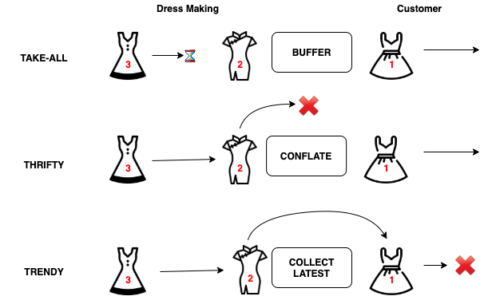

# Kalasim Developer Documentation & Notes

## domain config

https://medium.com/@hossainkhan/using-custom-domain-for-github-pages-86b303d3918a

https://stackoverflow.com/questions/30833110/github-pages-custom-domain-settings

Just one cname per domain is allowed -> https://serverfault.com/questions/574072/can-we-have-multiple-cnames-for-a-single-name#:~:text=You%20cannot.,making%20a%20CNAME%20entry%20inappropriate.


many votes https://stackoverflow.com/questions/9082499/custom-domain-for-github-project-pages --> worked


To support CNAME in mkdocs see https://www.mkdocs.org/user-guide/deploying-your-docs/

## Koin pointers

https://medium.com/mobile-app-development-publication/kotlin-koin-scope-illustrated-3bfa6c7ae98

<https://medium.com/koin-developers/ready-for-koin-2-0-2722ab59cac3>
>  startKoin declaration function which declare your Koin instance into the GlobalContext, use the koinApplication function to declare a local Koin instance.


How to bind interface? https://stackoverflow.com/questions/57816557/provide-an-instance-as-its-interface-in-koin

## salabim

doc sources --> https://www.salabim.org/manual/ view page sources

main differences
* interpreter vs jvm performance


## github actions

revert remote tags that prevent pushing because of
> error: dst refspec refs/heads/master matches more than one

https://github.com/actions/create-release/issues/13

```bash
git push origin :refs/tags/refs/heads/master
```

## coroutines

<https://medium.com/livefront/suspending-lambdas-in-kotlin-7319d2d7092a>
> `(suspend () -> T)`


<https://stackoverflow.com/questions/40161956/kotlin-sequence-concatenation>


---

<https://medium.com/mobile-app-development-publication/kotlin-flow-buffer-is-like-a-fashion-adoption-31630a9cdb00>


## Priortiy Queue

https://newbedev.com/how-to-iterate-over-a-priorityqueue

> It's not a sorted array, so that you can just go from one element to the one with the lesser priority.
> 
> Peeking (read the top element heap in the heap) is constant time O(1) because it looks at the smallest element.
> 
> To get the second next one you must dequeue the smallest top element, that's how it works.
> Dequeing (re-heapify = O(log n) time) isn't just a matter of taking that element out, the underlying structure rearranges itself in order to bring the element with the least priority first.
        

Workaround https://stackoverflow.com/questions/8129122/how-to-iterate-over-a-priorityqueue --> sort it outside using the queue comparator
```kotlin
Arrays.sort(theActualArray, pq.comparer())
Arrays.sort(pq.toArray())
```

## misc

publish the central

* old plugin https://raw.githubusercontent.com/bozaro/git-lfs-java/4038db01066f9326dc3d7a40c6218824d0bf62f3/build.gradle.kts
* https://github.com/cortinico/kotlin-android-template
* https://github.com/gradle-nexus/publish-plugin
* https://github.com/Ninja-Squad/DbSetup/blob/master/build.gradle.kts
* sigining credentials https://github.com/vanniktech/gradle-maven-publish-plugin/issues/71

consume sequence `seq.toList()`

## Structured logging


> Structured logging is the practice of implementing a consistent, predetermined message format for application logs that allows them to be treated as data sets rather than text.

https://tersesystems.github.io/terse-logback/1.0.0/structured-logging/

https://www.innoq.com/en/blog/structured-logging/


