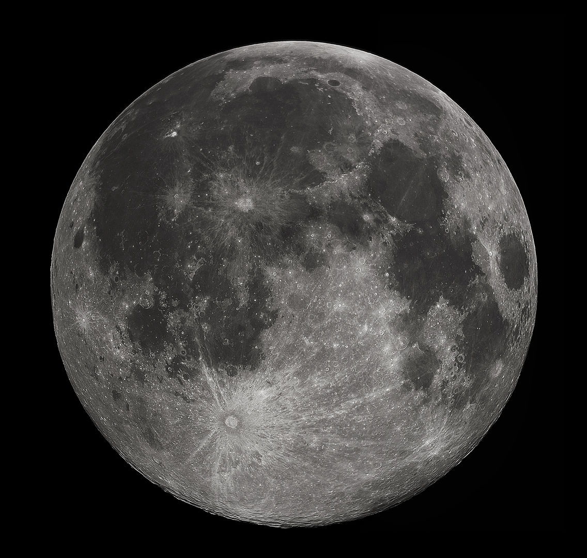

# Lunar Mining

Mining robots scan the ground of the moon for depletable water  deposits.

From Wikipedia on [Lunar Resources](https://en.wikipedia.org/wiki/Lunar_resources)
> The Moon bears substantial natural resources which could be exploited in the future. Potential lunar resources may encompass processable materials such as volatiles and minerals, along with geologic structures such as lava tubes that together, might enable lunar habitation. The use of resources on the Moon may provide a means of reducing the cost and risk of lunar exploration and beyond.

In a not so distant future, mankind will have established a permanent base on the moon. To fulfil the demand for water, the Earth Space Agency (ESPA) has decided to deploy a fleet of autonomous mining robots. These robots will analyze the area for possible water-ice deposits. Detected deposits will be mined, and ice/water will be shipped and stored in the base station.  

{: .center}

<i><a href="https://en.wikipedia.org/wiki/Moon">Full moon photograph</a> taken 10-22-2010 from Madison, Alabama, USA; CC BY-SA 3.0</i>

To estimate water production rates, a simulation shall be created. Also with the simulation, the number of mining robots needed to supply the base with the minimum required amount of water shall be determined.  

So while being fun in nature, the example illustrates 2 of the most important tasks for industrial engineering
1. Capacity Planning 
2. Forecast of Production KPIs (tons of water/day)

## Simulation Model Structure

* Initially deposits are not known
* Small harvester robots are being deployed from a central depot to scan the lunar surface for water deposits
* When finding a depot they deplete it
* They have a limited storage capacity, so they will need to shuttle the cargo to the depot
* The base will consume water constantly
* The base has an initial deposit of water (which was shipped to the moon very expensively with rockets from earth)
* Idle harvesters will consult the base for nearby deposits discovered by other units

## Animation

The model can be expressed easily in approximately 200 lines of [process definitions](../component.md#process-definition) in [`LunarMining.kt`](https://github.com/holgerbrandl/kalasim/blob/master/simulations/lunar-mining/src/main/kotlin/org/kalasim/sims/moon/LunarMining.kt)

To work out an optimal number of water-ice mining robots, a process [animation](animation.md) was developed as well to understand the spatio-temporal dynamics better.

  <iframe width="1280" height="720" src="https://www.youtube.com/embed/vZNyjuNLhIk" frameborder="0" allowfullscreen></iframe>

## Exercise: Maintenance Module

The model could be extended to model robot health as well

* Occasional meteoroids hits will affect the harvester health status (with the varying amount, and which eventually will lead to robot outage)
* Harvesters health is slowly decreasing while depleting deposits
* Harvesters can be repaired in a special maintenance depot (which is a bit far off)
    * Picking up broken robots is very expensive
    * Field Maintenance is very very time-consuming and should be avoided if possible