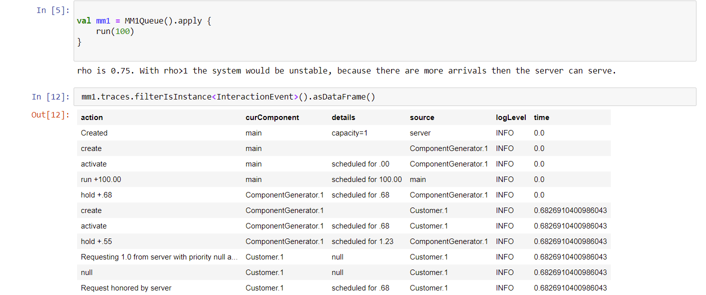

# Event Log

To analyze a simulation, you may want to monitor entity creation and process progression. You may also want to trace which process caused an event or which processes waited for an event. `kalasim` is collecting these data for all  [simulation entities](basics.md) and in also within its [interaction model](component.md#process-interaction).


The event log is modelled as a sequence of `org.kalasim.Event`s that be consumed  with `org.kalasim.EventListener`. We follow a classical  publish-subscribe pattern here, where users can easily attach different monitoring backends such as files, databases, or in-place-analytics.

```kotlin
createSimulation { 
    addEventListener{ it: Event -> println(it)}    
}
```

Event listener implementations typically do not consume all events but filter for specific types or simulation entities. This filtering can be implemented in the listener or by providing a filter

```kotlin
class MyEventLister : EventListener{
    override fun consume(event: Event) {
        println(event)
    }

    override val filter = EventFilter { it is ResourceEvent }
}
```

Users typically create custom simulation events and corresponding listeners to consume state changes for analysis and visualization. 

```kotlin  hl_lines="1000"
{!api/CustomEvent.kts!}
```

## Console Logger

There are a few provided event listeners, most notable the built-int console logger. With console logging being enabled, we get the following output (displayed as table for convenience):

```
time      current component        component                action      info                          
--------- ------------------------ ------------------------ ----------- -----------------------------
.00                                main                     DATA        create
.00       main
.00                                Car.1                    DATA        create
.00                                Car.1                    DATA        activate
.00                                main                     CURRENT     run +5.0
.00       Car.1
.00                                Car.1                    CURRENT     hold +1.0
1.00                               Car.1                    CURRENT
1.00                               Car.1                    DATA        ended
5.00      main
Process finished with exit code 0
```

Console logging is not active by default as it would considerably slow down larger simulations, and but must be enabled when creating a simulation with `createSimulation(enableConsoleLogger = true)`

!!!note 
    The user can change the width of individual columns with `ConsoleTraceLogger.setColumnWidth()`

## Event Collector

A more selective monitor that will just events of a certain type is the event collector. It needs to be created before running the simulation (or from the moment when events shall be collected).

```kotlin
class MyEvent(time : TickTime) : Event(time)

// run the sim which create many events including some MyEvents
env.run()

val myEvents :List<MyEvent> = eventCollector<MyEvent>()

// e.g. save them into a csv file with krangl
myEvents.asDataFrame().writeCsv(File("my_events.csv"))
```
This collector will have a much reduced memory footprint compared to the [trace-collector](#trace-collector).

## Trace Collector

Another built-in event listener is the trace collector, which simply records **all** events and puts them in a list for later analysis.

For example to fetch all events in retrospect related to resource requests we could filter by the corresponding event type

```kotlin
//{!api/EventCollector.kts!}
```


## Asynchronous Processing


Trace logs a suitable for standard kotlin collection processing. E.g. we could setup a [coroutines channel](https://kotlinlang.org/docs/reference/coroutines/channels.html) for log events to be consumed asynchronously.

```kotlin
//{!analysis/LogChannelConsumer.kts!}
```

In the example, we can think of a channel as a pipe between two coroutines. For details see the great articlle [_Kotlin: Diving in to Coroutines and Channels_]( 
https://proandroiddev.com/kotlin-coroutines-channels-csp-android-db441400965f).

Alternatively, we can use the simpler `AsyncEventListener` DSL to process the events:

```kotlin
//{!analysis/LogChannelConsumerDsl.kts!}
```

## Logging Configuration

Typically, only some types of event logging are required in a given simulation. To optimize simulation performance, the engine allows to suppress selectivly per event type and simulation entity. This is configured via [tracking policy factory](advanced.md#continuous-simulation) 

## Tabular Interface

A typesafe data-structure is usually the preferred for modelling. However, accessing data in a tabular format can also be helpful to enable statistical analyses. Enabled by krangl's `Iterable<T>.asDataFrame()` extension, we can  transform  records, events and simulation entities easily into tables. This also provides a semantic compatibility layer with other DES engines (such as [simmer](about.md#simmer)), that are centered around tables for model analysis.

We can apply such a transformation simulation `Event`s. For example, we can apply an instance filter to the recorded log to extract only log records relating to resource requests. These can be transformed and converted to a csv with just:

```kotlin
// ... add your simulation here ...
data class RequestRecord(val requester: String, val timestamp: Double, 
            val resource: String, val quantity: Double)

val tc = sim.get<TraceCollector>()
val requests = tc.filterIsInstance<ResourceEvent>().map {
    val amountDirected = (if(it.type == ResourceEventType.RELEASED) -1 else 1) * it.amount
    RequestRecord(it.requester.name, it.time, it.resource.name, amountDirected)
}

// transform data into data-frame (for visualization and stats)  
requests.asDataFrame().writeCSV("requests.csv")
```

The transformation step is optional, `List<Event>` can be transformed `asDataFrame()` directly.


## Events in Jupyter

When working with jupyter, we can harvest the kernel's built-in rendering capabilities to render events. Note that we need to filter for specific event type to capture all attributes.



For a fully worked out example see 