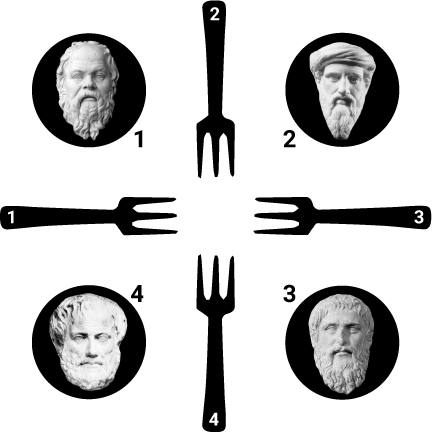

The [Dining Philosophers problem](https://en.wikipedia.org/wiki/Dining_philosophers_problem) is a classical example in computer science to illustrate synchronisation issues in concurrent processes. It was originally formulated in 1965 by [E. W. Dijkstra](https://en.wikipedia.org/wiki/Edsger_W._Dijkstra) as a student exam exercise, and was later reworked in its current form by [Tony Hoare](https://en.wikipedia.org/wiki/Tony_Hoare):

> $N$ silent philosophers sit at a round table with bowls of spaghetti with tomato sauce and tasty cheese. Forks are placed between each pair of adjacent philosophers.
>
> Each philosopher must alternately think and eat. However, a philosopher can only eat spaghetti when they have both left and right forks. Each fork can be held by only one philosopher and so a philosopher can use the fork only if it is not being used by another philosopher. After an individual philosopher finishes eating, they need to put down both forks so that the forks become available to others. A philosopher can take the fork on their right or the one on their left as they become available, but cannot start eating before getting both forks.

{: .center}

> The problem is how to design a discipline of behavior (a concurrent algorithm) such that no philosopher will starve; i.e., each can forever continue to alternate between eating and thinking, assuming no philosopher can know when others may want to eat or think.

## Simulation

Let us define each philosopher as a process executing a thinking + eating loop, and acting concurrently on shared resources (the forks). Each process will follow a similar trajectory in which they

1. Spend some random time thinking until they become hungry.
2. Take one fork, when available, following a given policy.
3. After some lag, take the other fork, when available.
4. Spend some random time eating.
5. Put both forks down and go back to 1.

The following function sets up a simulation of $N$ dining philosophers as established above:


The `fork_seq` argument consists of a named list of fork sequences. For instance, given the numbering conventions in the image above, if we decide that philosopher 1, Socrates, must take fork 1 first and then fork 2, his fork sequence would be `Socrates = c(1, 2)`. This function also expects the simulation `time`, and there are other arguments to play with, such as the `thinking` and `eating` random processes, the `lag` between forks, and the seed.

The following function would allow us to plot a kind of Gantt chart of the simulation:

```{r, message=FALSE}
states <- c("hungry", "eating")
philosophers_gantt <- function(env, size=15) env %>%
  get_mon_arrivals(per_resource=TRUE) %>%
  transform(philosopher = sub("_[0-9]*", "", name),
            state = factor(states, states)) %>%
  ggplot(aes(y=philosopher, yend=philosopher)) + xlab("time") +
  geom_segment(aes(x=start_time, xend=end_time, color=state), size=size)
```

With the simplest algorithm, each philosopher would take, for example, the right fork first and then the left one. But it is easy to see that this policy may result in starvation:

```{r, message=FALSE}
fork_seq <- list(
  Socrates   = c(1, 2),
  Pythagoras = c(2, 3),
  Plato      = c(3, 4),
  Aristotle  = c(4, 1)
)
simulate(fork_seq, time=50) %>%
  print() %>%
  philosophers_gantt() + theme_bw()
```

As we can see, the simulation stopped very soon at a point in which every philosopher holds one fork and waits for the other to be available. The solution originally proposed by Dijkstra establishes the convention that all resources must be requested in order. This means that, in our simulation, Aristotle should pick fork 1 first instead:

```{r, message=FALSE}
fork_seq$Aristotle <- rev(fork_seq$Aristotle)
simulate(fork_seq, time=50) %>%
  print() %>%
  philosophers_gantt() + theme_bw()
```

This example was adopted from the [simmer manual](https://r-simmer.org/articles/simmer-08-philosophers.html).